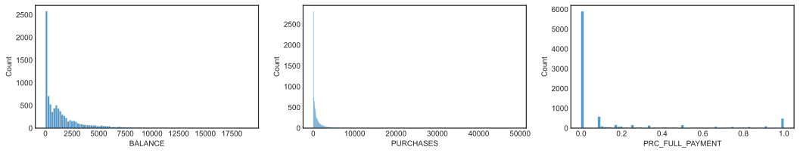
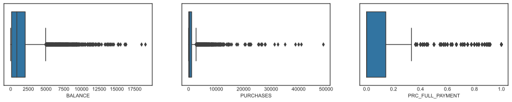
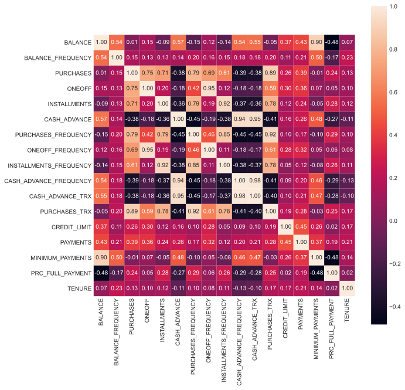
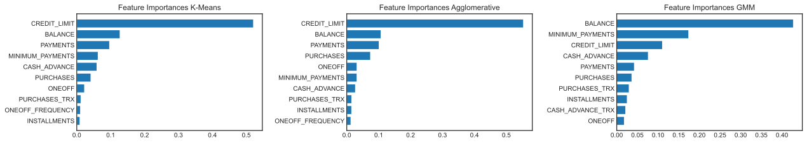
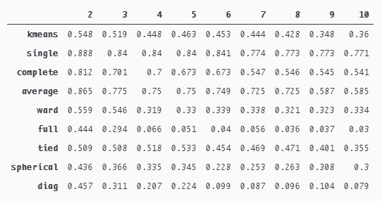
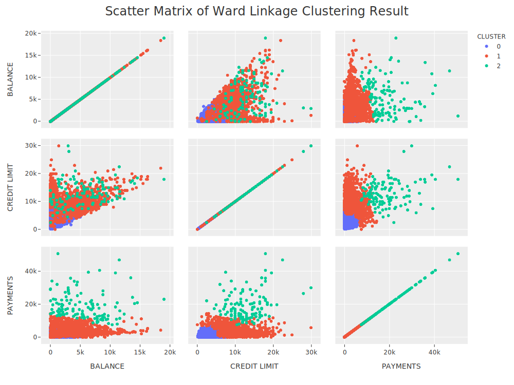
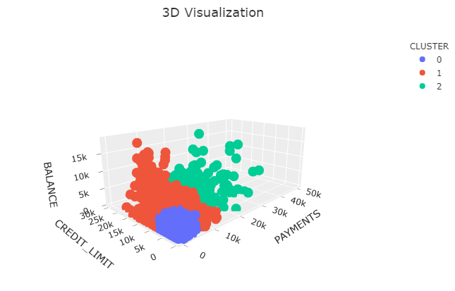
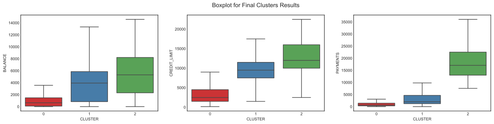

# CREDIT CARD CUSTOMER SEGMENTATION USING CLUSTERING ALGORITHM

Scikit-Learn Team Members :
1. Lidya Kurniawati Tjahja - [Email](lidyaktjahja@gmail.com) | [LinkedIn](https://www.linkedin.com/in/lidyaktjahja/)
2. Stefanus Ivan Laksono - [Email](stefanusivanlaksono@gmail.com) | [LinkedIn](https://www.linkedin.com/in/stefanusivanlaksono/)

Source : <a href="https://www.kaggle.com/arjunbhasin2013/ccdata">Credit Card Dataset for Clustering</a> 
Notes : if credit_card.ipynb doesn't load plotly graphics in Github, please open credit_card.html

---

# I. Business Understanding
## Background and Problem Statement
Credit card business competition is very tight. Customers can easily switch to another credit card that has lower overall fees. According to <a href="https://www.dbmarketing.com/articles/Art175.htm">How to Retain a Credit Card Customer</a>, it costs about $80 to get a new credit card customer who would returns about $120 a year in profit to the company only if they keep the card. If he drops the card after a few weeks or doesn't use the card, the company will lose the customer acquisition cost (CAC) plus some more money when trying to reactivate them. In addition, Financial Publishing Services also state in their <a href="https://www.fpsc.com/the_cost_of_customer_churn.pdf">research</a> that CAC is estimated at five times the rate of retaining existing ones. It clearly shows that every credit card issuer must put their best effort to retain their customers. The right retention strategy can increase the company's chances of retaining its customers and further reduce the estimated loss that will be cover by the company. 

Customer loyalty is one of a key factor to keep the customers loyal to our company. <a href="https://sendpulse.com/support/glossary/customer-loyalty">Why is customer loyalty is important?</a> Customer loyalty is important because; repeat customers spend more than first-time customers, loyal customers produce higher conversion rates, it boosts profits, retaining an existing customer is cheaper than acquiring a new one, customer loyalty helps in effective planning, loyal customer shop regularly, repeat customers spend more during the holiday. We can <a href="https://sendpulse.com/support/glossary/customer-loyalty">increase the loyalty</a> of our customers by reward loyal customers with a loyalty program, make customer care a priority for the brand, boost customer experience by introducing VIP tiers, segment and personalize your clients, send event-based emails, optimize the businesses' referral program, encourage customers to give feedback and act on it. We can measure our customer loyalty based on lifetime value, churn rate, referrals, and net promoter code. 

PWDK Bank is one of the credit card issuers in USA. Currently the company only has one type of credit card. In order to serve customers better, the company plan to release new types of credit card based on customer's needs. In this project, we position ourselves as part of the Data Scientist team at PWDK Bank. We were assigned to the marketing division to segment credit card users based on credit card usage in the last six months. 

## Business Objectives

The business objectives that we want to achieve through this project are as follows:
- Create credit card customer segmentations based on their credit card usage.
- Provide information and suggestion for credit card development based on customer segmentation result

## Data Availability

The data owned by the company is limited to credit card users only. We will use the information from their credit card usage behavior like credit limit, balance, purchases, and payments from the last six months.

## Analytic Approach
Unsupervised learning becomes our machine learning model to address this issue since it didn't have labels. The cleaned dataset will be trained into the unsupervised learning model and the model will generate customer segmentation. The goodness of cluster resulted by the model will be evaluated using clustering evaluation metrics like silhouette scores and within-cluster sum of square (WCSS).

Incorrect segmentation can lead to two possible losses for the bank:
- The first scenario is when we segment customers to a lower cluster when they should be in a higher segment. This scenario can cause the bank to lose the opportunity to make more profits since they tend to spend more money and increase. It also increase the probability of a customer to churn.
- The second scenario is when customers are grouped at a higher segment when they should be at a lower segment. This issue can cause the company to suffer losses if the customer cannot pay his credit card bill or an opportunity loss if the customer didn't fully utilize the balance in their credit card.

---

# II. Data Understanding
We used <a href="https://www.kaggle.com/arjunbhasin2013/ccdata">Credit Card Dataset for Clustering</a> dataset in Kaggle. The dataset summarizes the usage behavior of 8950 credit card customers during the last 6 months. The file is at a customer level with 18 behavioral variables. The following is a display of the first five rows of the dataset.

CUST_ID | BALANCE | BALANCE_FREQUENCY | PURCHASES | ONEOFF_PURCHASES | INSTALLMENTS_PURCHASES | CASH_ADVANCE | PURCHASES_FREQUENCY | ONEOFF_PURCHASES_FREQUENCY | PURCHASES_INSTALLMENTS_FREQUENCY | CASH_ADVANCE_FREQUENCY | CASH_ADVANCE_TRX | PURCHASES_TRX | CREDIT_LIMIT | PAYMENTS | MINIMUM_PAYMENTS | PRC_FULL_PAYMENT | TENURE
-----|-----|-----|-----|-----|-----|-----|-----|-----|-----|-----|-----|-----|-----|-----|-----|-----|-----
C10001 | 40.900749 | 0.818182 | 95.4 | 0 | 95.4 | 0 | 0.166667 | 0 | 0.083333 | 0 | 0 | 2 | 1000 | 201.802084 | 139.509787 | 0 | 12
C10002 | 3202.467416 | 0.909091 | 0 | 0 | 0 | 6442.945483 | 0 | 0 | 0 | 0.25 | 4 | 0 | 7000 | 4103.032597 | 1072.340217 | 0.222222 | 12
C10003 | 2495.148862 | 1 | 773.17 | 773.17 | 0 | 0 | 1 | 1 | 0 | 0 | 0 | 12 | 7500 | 622.066742 | 627.284787 | 0 | 12
C10004 | 1666.670542 | 0.636364 | 1499 | 1499 | 0 | 205.788017 | 0.083333 | 0.083333 | 0 | 0.083333 | 1 | 1 | 7500 | 0 |  | 0 | 12
C10005 | 817.714335 | 1 | 16 | 16 | 0 | 0 | 0.083333 | 0.083333 | 0 | 0 | 0 | 1 | 1200 | 678.334763 | 244.791237 | 0 | 12

Below is the definition of each features:
- `CUST_ID` - Identification of credit card customer
- `BALANCE` - Balance amount left in their account to make purchases
- `BALANCE_FREQUENCY` - How frequently the balance is updated, score between 0 and 1 
  - 1 = frequently updated
  - 0 = not frequently updated
- `PURCHASES` - Amount of purchases made from account 
- `ONEOFF` - Maximum purchase amount done in one-go
- `INSTALLMENTS` - Amount of purchase done in installment
- `CASH_ADVANCE` - Cash in advance given by the user
- `PURCHASES_FREQUENCY` - How frequent the purchases are being made, score between 0 and 1
  - 1 = frequently updated
  - 0 = not frequently updated
- `ONEOFF_FREQUENCY` - How frequent purchases are happening in one-go
  - 1 = frequently updated
  - 0 = not frequently updated 
- `INSTALLMENTS_FREQUENCY` - How frequent purchases in installments are being done
  - 1 = frequently updated
  - 0 = not frequently updated 
- `CASH_ADVANCE_FREQUENCY` - How frequently the cash in advance being paid
- `CASH_ADVANCE_TRX` - Number of transactions made with cash in advance 
- `PURCHASES_TRX ` - Number of purchase transactions made 
- `CREDIT_LIMIT` - Limit of credit card for user
- `PAYMENTS` - Amount of payment done by user
- `MINIMUM_PAYMENTS` - Minimum amount of payments made by user
- `PRC_FULL_PAYMENT` - Percent of full payment paid by user
- `TENURE` - Tenure of credit card service for user

---

# III. Exploratory Data Analysis

## Data Distribution Plot
We check data distribution for each feature using descriptive statistics, histogram, and boxplot.
- Overall, each feature has right-skewed distribution because of the anomaly behaviors of the small proportion of customers. 
- Majority of customers have `BALANCE` value close to zero. It can be concluded that the company has many active customers
- Not many customers can make full payments on their credit card bills (the largest percentage of `PRC_FULL_PAYMENT` is on zero value)

## Data Correlation
We calculate Spearman's correlation coefficient for each pair of features and show the result on a heatmap.
- `PURCHASES` has a strong positive relationship with `PURCHASES_FREQUENCY` and `PURCHASES_TRX`. `CASH_ADVANCE` has a strong positive relationship with `CASH_ADVANCE_FREQUENCY` and `CASH_ADVANCE_TRX`. Both results show that the high value of `PURCHASES` and 'CASH_ADVANCE` is influenced by the number of transactions and frequency.
- `PURCHASES` also has strong positive relationship with `ONEOFF`, `INSTALLMENTS`, `ONEOFF_FREQUENCY`, and `INSTALLMENTS_FREQUENCY`. If we add the value of `ONEOFF` and `INSTALLMENTS` columns, we will get the same value with the PURCHASES column.

## Identify Missing Values, Duplicates, and Outlier 
- There is no duplicate on this dataset.
- There are 313 missing values on `MINIMUM_PAYMENTS` and 1 missing value on `CREDIT_LIMIT`.
- There are many outliers for each feature and we decided not to apply any process to them.

---

# IV. Data Preprocessing

## Remove Unnecessary Features
Based on the results of data understanding and exploratory data analysis, we decided not to use `CUST_ID` as input to the machine learning clustering model. `CUST_ID` has a unique value for each entry and does not provide any useful information for customer segmentation.  

## Missing Values Handling  
There are 313 missing values on `MINIMUM_PAYMENTS` and 1 missing value on `CREDIT_LIMIT`.
- Missing value in `CREDIT_LIMIT` column is dropped because there is only 1 data that has a null value.
- Missing values in `MINIMUM_PAYMENTS` are filled with zero when the corresponding row also has zero value on the`PAYMENTS`
- For customers whose `PAYMENTS` is not zero, we filled `MINIMUM_PAYMENTS` missing values to be the same as `PAYMENTS`

---

# V. Customer Segmentation Modeling and Analysis

## Clustering Algorithms
For the modeling process, we used 3 clustering algorithms as below: 
- K-Means
- Agglomerative
  - Single Linkage Clustering
  - Complete Linkage Clustering
  - Average Linkage Clustering
  - Ward Linkage Clustering
- Gaussian Mixture Models (GMM)
  - Tied
  - Spherical
  - Full
  - Diag

## Evaluation Metrics
The main evaluation metrics that we used are **Silhouette Score** and **WCSS (Within-Cluster Sum of Square)**. We can applied silhouette score to evaluate any clustering results and WCSS only to evaluate K-Means clustering results. Silhouette score values range from -1 to 1 and here is the interpretation of 1, 0, and -1.
- 1 : Means clusters are well apart from each other and distinguished
- 0 : Means clusters are indifferent, or we can say that the distance between clusters is not significant. 
- -1 : Means clusters are assigned in the wrong way

## Features Selection
We want to build a model that has high interpretability, so feature selection can be done to reduce the model complexity. Selected features will have significant impact to the cluster results. Feature selection was done in the following procedures:

1. Cluster the dataset using all features and evaluate the clustering results for each cluster algorithm
2. Select the optimal number of cluster for each cluster algorithm
3. Generate violinplot for each feature with the number of cluster selected and evaluate the potential significant features visually
4. Create a new dataset by adding the clustering result to the initial dataset
5. Split dataset into train and test by using clustering results column as a targets or labels
6. Train a classification machine learning model that has a feature_importances attribute (decision trees and random forest) with the train set
7. Predict the test set labels outcome with the selected classification machine learning model and make sure it has good evaluation score
8. Generate the feature_importances from the model and analyze it for each cluster algorithm

We used the **Random Forest** model as a multi-class classification model and the model gave the following results: 

Based on features selection results, we selected 3 features that have significant impact on defining credit card customers cluster:
- `CREDIT LIMIT`
- `BALANCE`
- `PAYMENTS`

The following are the comparison of silhouette scores for each algorithm within a range number of cluster: 
 
 - **Single Linkage**, **Complete Linkage**, and **Average Linkage** are excluded from the model selection process. Although their cluster results produce very high silhouette scores, the distribution of cluster membership is very unrealistic. For example, single linkage clustering will create 3 clusters with 8947 members in cluster 0, 1 member in cluster 1, and 1 member in cluster 2.
 - The cluster results from **Full Covariance GMM**, **Spherical Covariance GMM**, and **Diag Covariance GMM** do not produce good silhouette scores, so we also exclude them from the model selection process.
 - Generally, silhouette score decreases when the customers are segmented into 4 clusters. Within 3 clusters, **Ward Linkage** has better silhouette score (0.546) compared to **K-Means** (0.519) and **Tied Covariance GMM** (0.508). We decided to choose Ward Linkage that segment customer into 3 clusters as the final model.

## Cluster Analysis
Based on the results of the silhouette score and the visualization of the separation between clusters, we choose the Ward Linkage as the final cluster model. To be able to interpret the behavior characteristics of each cluster, we made several visualizations as follows:
- Clusters visualization in 2D and 3D
- Boxplot (exclude outliers)

From visualizations above, we can conclude that:
#### **CLUSTER 0 (LOW SPENDERS)**
This cluster consist of 80% credit card customers who have **LOW `BALANCES`**, **LOW `PAYMENTS`**, and **LOW `CREDIT_LIMIT`**.
- `BALANCE`: 0 – 4000
- `CREDIT_LIMIT`: 0 – 10000
- `PAYMENTS`: 0 – 4000

#### **CLUSTER 1 (MEDIUM SPENDERS)**
This cluster consist of 18% credit card customers who have **LOW-MEDIUM `BALANCES`**, **MEDIUM `PAYMENTS`**, and **MEDIUM `CREDIT_LIMIT`**
- `BALANCE`: 0 – 13000
- `CREDIT_LIMIT`: 2500 – 17500
- `PAYMENTS`: 0 – 10000

#### **CLUSTER 2 (HIGH SPENDERS)**
This cluster consist of 2% credit card customers who have **LOW-HIGH `BALANCES`**, **HIGH `PAYMENTS`**, and **HIGH `CREDIT_LIMIT`**
- `BALANCE`: 0 – 14000
- `CREDIT_LIMIT`: 3000 – 25000
- `PAYMENTS`: 7000 – 35000

---

# VI. Recommendation
## Credit Card Product
### PWDK Silver Credit Card
- Maximum credit limit value around \$9.000 to \$10.000
- Annual fees **LOW** or can be waived
- Rewards:
    - Cash back **LOW** (prioritize for purchasing daily necessities (product from supermarket and restaurant))
### PWDK Gold Credit Card
- Maximum credit limit value around \$16.000 to \$18.000
- Annual fees **MEDIUM**
- Rewards:
    - Cash back **MEDIUM**
    - Travel miles points **LOW** for each credit card usage
### PWDK Platinum Credit Card
- Maximum credit limit value around \$22.000 (there is a high possibility that the bank will increase this value to much higher value according to customer payment capability)
- Annual fees **HIGH**
- Rewards:
    - Cash back **HIGH** (offers cash back for purchasing high value products)
    - Travel miles points **HIGH** for each credit card usage
    - Free premium service at the airport

# VII. Business Impact
Based on data from <a href="https://www.statista.com/statistics/816735/customer-churn-rate-by-industry-us/">Statista</a>, we know that the average churn rate in 2020 for the financial and credit sector is 25%. According to <a href="https://www.bain.com/client-results/right-value-for-the-right-customers/">Bain & Company</a>, by migrating to the right customer relationships and improving the value proposition, customer segmentation can increase retention by 4% and increase profits by 11%. From other sources, retention may increase varies from a range of 3-5%.  After having a market segment, we assume that the customer retention rate at PWDK Bank will increase 3%-5% with each customer return $120 in profit by using our credit card product. **From our simulation, credit card customer segmentation can increase company profit by 4% to 6,7%**.
